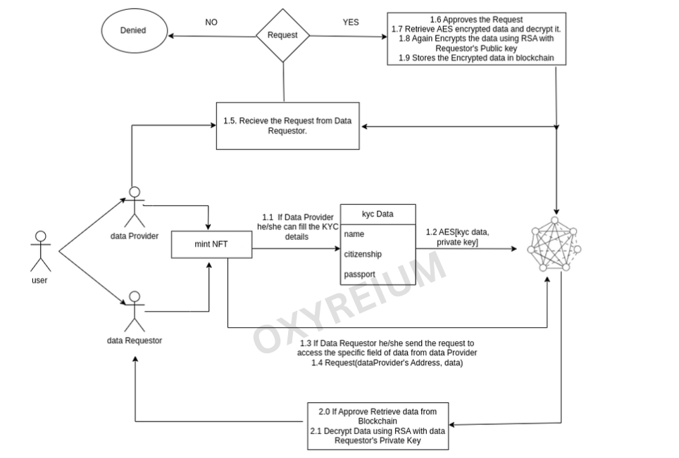

# OxAuth

OxAuth is a decentralized and non-custodial KYC system that leverages blockchain technology to provide users with complete control over their personal identity data. By utilizing advanced encryption and authentication mechanisms, OxAuth ensures the security and privacy of user data while enabling efficient and trustless verification and validation processes.

| **Table of Content**           |
| ------------------------------ |
| **Why OxAuth?**                |
| **OxAuth Architecture**        |
| **Steps To Run The OxAuth** |
| - REQUIREMENTS                 |
| - QUICKSTART                   |
| - USAGE                        |
| - DEPLOY                       |
| - TESTING                      |

## Why OxAuth?

-   To provide users with complete control over their data and privacy, ensuring that they are able to manage and access their personal information as they see fit.

-   To eliminate the need for users to repeatedly fill in the same information, creating a more seamless and efficient experience for users interacting with multiple organizations.

-   To ensure secure interactions between users and third parties, we plan to implement advanced encryption techniques such as AES and RSA, protecting user data from unauthorized access or modification.

## Architecture of OxAuth



## Steps to run OxAuth

**REQUIREMENTS**

-   [git](https://git-scm.com/book/en/v2/Getting-Started-Installing-Git)

-   You'll know you did it right if you can run git --version and you see a response like "git version x.x.x".

-   [Nodejs](https://classic.yarnpkg.com/lang/en/docs/install/)

-   You'll know you've installed nodejs right if you can run:

-   node --version and get an output like: vx.x.x

-   [Yarn](https://yarnpkg.com/getting-started/install) instead of npm

-   You'll know you've installed yarn right if you can run:

-   yarn --version and get an output like: x.x.x

-   You might need to [install it with npm]() or corepack

### QUICKSTART

```

    git clone https://github.com/spo0ds/OxAuth.git

    cd OxAuth

    yarn

```

### USAGE

To run on local blockchain

```

    yarn hardhat node

```

### DEPLOY

```

    yarn hardhat deploy

```

### TESTING

```

    yarn hardhat test

```

**FRONTEND SECTION**

[PROCEED TO FRONTEND SECTION](https://github.com/spo0ds/OxAuth_FrontEnd)

# THANK YOU!
